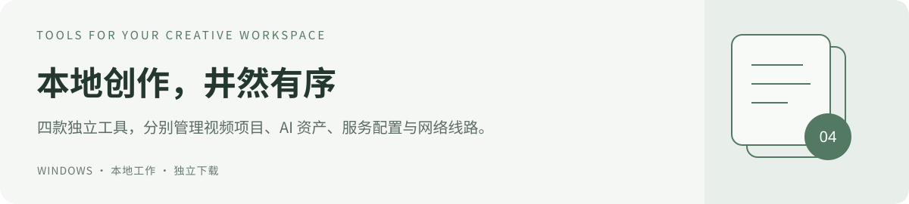

# 本地创作工具集

从整理剧本与分镜，到查找模型、管理服务配置和网络线路。这里的四款 Windows 软件各有独立目录、功能说明与下载包，你可以按需要单独使用。

**[映序：视频项目](yingxu/)** · **[AI Hub：模型资产](ai-hub/)** · **[Codex Switcher：服务配置](codex-switcher/)** · **[FlowSwitch：网络线路](proxy-switch/)**

## 选择你的工作台

| 你现在想做什么 | 对应项目 | 当前版本 | 下载 Windows 程序包 |
| --- | --- | --- | --- |
| 写剧本、管分镜，按集数整理角色、场景和生成结果 | **[映序 YingXu](yingxu/)** | 0.3.4 | **[下载映序](https://github.com/turnsolesama/portfolio/releases/download/yingxu-v0.3.4/YingXu-v0.3.4-Windows-x64.zip)** |
| 查模型与 LoRA，用分类、图库和路径记录整理 AI 资产 | **[AI Hub](ai-hub/)** | 2.5.0 | **[下载 AI Hub · 1.04 MiB](https://raw.githubusercontent.com/turnsolesama/portfolio/main/ai-hub/releases/AI-Hub-v2.5.0-Windows-x64.zip)** |
| 导入 API 示例，管理服务、密钥变量和 Codex 配置切换 | **[Codex Switcher](codex-switcher/)** | 2.4.1 | **[下载切换器 · 327 KiB](https://raw.githubusercontent.com/turnsolesama/portfolio/main/codex-switcher/releases/Codex-Switcher-v2.4.1-Windows-x64.zip)** |
| 管理已有代理、统一出口，给程序设置专用线路 | **[流向 FlowSwitch](proxy-switch/)** | 3.5.1 | **[下载 FlowSwitch · 68.1 MiB](https://raw.githubusercontent.com/turnsolesama/portfolio/main/proxy-switch/releases/FlowSwitch-v3.5.1-Windows-x64.zip)** |

每个 ZIP 只包含对应软件。下载链接直接取得压缩包；完整解压后再运行，保留包内文件夹。各项目页面提供源码说明、校验值和版本记录；映序的程序包已包含源码。

## 01 · 映序 YingXu

**把一部作品的剧本、素材和制作进度放在同一个项目里。**

- **长期项目库**：用多层分类文件夹归类项目，侧栏仅保留当前与最近项目。逻辑分类不会搬动磁盘素材。
- **设置与桌面**：删除确认、托盘与播放偏好可配置；托盘双击唤回，从 Windows“打开方式”直接只读预览本地文件。
- **项目与分类**：剧本、分镜、角色、场景、道具、参考、白模预演、生成素材和交付。支持多层文件夹，用“跨集共用 / 第 1 集 / 第 2 集”整理系列作品。
- **文件工作区**：多标签打开、Markdown/文本编辑、Word 普通段落编辑、图片与音视频预览。支持拖入、移动、多选、改名，以及右键打开所在文件夹。
- **全局搜索**：Ctrl+K 或顶栏入口跨项目查找项目、文件与已注册 SKILL，显示来源、摘要和分页；Ctrl+F 继续搜索当前页面。
- **Markdown 实时预览**：可编辑文稿与自建 SKILL 默认边写边看排版，当前段落显示源码；源码、双栏与只读预览继续保留。
- **制作管理**：镜号、时长、提示词、标签、待审核等状态，连接角色与对应镜头；删除确认、回收站和恢复保护整理过程。
- **SKILL 与 AI 协作**：集中查看与编写技能，给项目绑定规范；生成普通 Markdown/JSON 交接文件，便于 Codex 等工具读取当前进度。

浅色中文界面，MIT 许可。专注项目管理、文档编辑与素材组织；剪辑时间线、完整 Word 排版和内嵌 3D 编辑暂未提供。

[进入映序 →](yingxu/) · [详细功能](yingxu/docs/功能指南.md) · [安装与运行](yingxu/docs/安装与运行.md)

## 02 · AI Hub

**围绕“用什么模型、素材在哪里”建立本地资产目录。**

- 按图片、视频、语言、音频等用途找模型；LoRA 支持风格、角色、光照、细节等多选分类。
- 查看模型架构、训练底模、触发词候选、评分、备注和来源；支持手动与批量调整分类。
- 图库提供搜索、模型引用筛选、大图查看和密度切换；资料与工作流可记录路径、依赖与说明。
- 统一分类视图与人工覆盖，区分所属范围、模型角色、创作用途和兼容架构；已有模型库只预览，散落资产区可按确认建立硬链接入口。
- 2.5 新增项目、运行和知识登记，记录当前说明与交付位置；工作流区分路径检查、历史通过与当前复验，证据变化后降低有效状态。

[进入 AI Hub →](ai-hub/) · [分类规则](ai-hub/docs/CLASSIFICATION.md) · [项目与证据登记](ai-hub/docs/REGISTRY.md) · [安全区整理](ai-hub/docs/SAFE_ZONE.md)

## 03 · Codex Switcher

**把多组 API 服务配置整理好，再手动应用到 Codex。**

- 新增、编辑、复制、搜索和移除服务；区分当前使用、未应用和需要修正的配置。
- 本地解析 JSON、TOML、env、cURL，以及受支持的 Python/Node.js SDK 示例，先预览再导入。
- 在官方登录模式与第三方 Responses API 配置间切换；应用前检查并备份，支持恢复。
- 密钥使用 Windows 用户环境变量，导出始终不含密钥；示例导入不执行代码，也不调用 API。

这是独立配置工具。导入或保存配置不会自动激活服务，应用后需要重新打开 Codex；服务商是否支持对应协议仍需确认。

[进入 Codex Switcher →](codex-switcher/) · [支持的导入格式](codex-switcher/#第三方导入格式) · [验证记录](codex-switcher/TEST_REPORT.md)

## 04 · 流向 FlowSwitch

**整理已有代理入口，观察软件的连接实际走向。**

- 添加 HTTP / SOCKS5 入口、发现后台代理、检测入口并保存可恢复的设置。
- 统一切换系统代理与相关用户环境变量，撤销本工具管理的程序专用线路。
- 自带独立分流内核，使用固定本地入口并按 EXE 路径选择线路；上游失效时按备用顺序接替。
- 保留有效备用出口，显示首选与实际出口；退出时先恢复仍归属本会话的网络设置。
- 区分规则已加载、已观察到出口、旧连接和入口外连接；先预览再确认重连所选程序的旧连接。

软件不提供 VPN、订阅或节点。完整包自带运行组件；按程序分流要求流量实际进入独立入口，不会自动开启 TUN 或退出其他应用。

[进入 FlowSwitch →](proxy-switch/) · [快速开始](proxy-switch/#快速开始) · [运行要求](proxy-switch/#运行要求)

## 下载以后

| 软件 | 双击入口 | 主要运行要求 |
| --- | --- | --- |
| 映序 | `YingXu.exe` | Windows 10 22H2 / Windows 11 x64；完整包自带 Python、图片与视频处理组件和 WebView2 |
| AI Hub | `AI Hub.exe` | Windows x64、Python 3.9+、.NET Framework 4.8+、WebView2 Runtime |
| Codex Switcher | `Codex Switcher.exe` | Windows x64、Python 3.11+（含 Tkinter）、.NET Framework 4.x |
| FlowSwitch | `FlowSwitch.exe` | Windows 10 1809+ / 11 x64、PowerShell 5.1、.NET Framework 4.x、curl；自带 Node.js 和独立内核 |

这些 EXE 是桌面启动入口，需要保留完整程序包，并满足各自的运行条件。映序 0.3.4 与 FlowSwitch 3.5.1 完整包已自带主要运行组件；各软件请按自己的说明配置。各包不包含模型权重或代理服务。

如果 GitHub 页面显示 **Error loading page**，可直接使用上表的下载链接；已经下载但不能启动时，请查看对应项目的运行要求。版本升级、数据保留和诊断步骤都放在各软件的独立说明中。

## 源码与许可

仓库按项目发布源码、程序包、图标和公开演示资源，不包含个人图集、模型权重、密钥、本机数据库或私人配置。各工具可独立下载，本仓库不设置订阅付费入口。

- **映序、FlowSwitch** 的原创代码使用各自随附的 MIT 许可，第三方组件遵循各自声明。
- **AI Hub、Codex Switcher** 当前公开源码，但尚未指定额外开源许可证；请以项目内的许可说明为准。

四款软件的用途和运行条件相互独立，可以根据工作需要组合使用。
