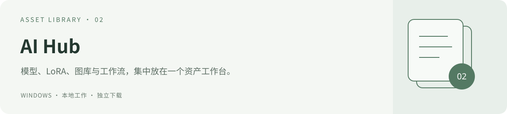

# AI Hub

[返回工具集](../) · [映序](../yingxu/) · [Codex Switcher](../codex-switcher/) · [FlowSwitch](../proxy-switch/)



**模型、素材与运行证据的本地目录。** 适合管理多个生成模型、维护 LoRA 分类、出图库以及项目运行记录的创作者。

[下载与启动](#获取与启动) · [常用功能](#常用功能) · [项目与验证登记](#项目与验证登记) · [数据与更新](#数据与更新) · [开发和构建](#开发和构建)

2.5.0：补齐项目与知识入口，统一分类、人工覆盖和工作流验证状态。[结构升级](docs/STRUCTURE_2.5.md)。

2.4.1：采用新生成的叠层资产图标，统一 EXE、窗口、侧栏及 favicon。[图标方案](docs/BRAND_2.4.1.md)。

2.4 视觉更新：紧凑导航、常用创作入口、用途分类和统计区，以及炭灰 / 冰蓝配色。[设计与验证](docs/VISUAL_2.4.md)。

在一个本地工作台里管理模型、LoRA、工作流、出图和资料。

AI Hub 采用炭灰界面，提供独立 Windows 桌面窗口。按图片、视频、语言、音频等用途找模型；按风格、角色、光照、细节等用途整理 LoRA。模型保留原文件位置，评分、备注与分类保存在本机。安全区整理通过硬链接建立分类入口，共用文件内容；编辑入口也会改变原件，不作为备份。

## 获取与启动

Windows 桌面包包含 `AI Hub.exe`、完整程序源码和使用说明。解压到一个可写目录后，双击 **AI Hub.exe**。请保留整个解压目录；桌面可以另建快捷方式。

运行条件：Windows x64、.NET Framework 4.8+、本机 Python 3.9+、Microsoft Edge WebView2 Runtime。桌面包不捆绑 Python 和 WebView2 Runtime，也不包含模型权重。程序会查找已安装的 Python；也支持将可用解释器放到 `runtime/python.exe`。

- [Python 官方 Windows 下载](https://www.python.org/downloads/windows/)
- [Microsoft WebView2 Runtime](https://developer.microsoft.com/microsoft-edge/webview2/)
- `start.vbs` 为备用浏览器入口；`debug.bat` 用于需要控制台输出的诊断。

首次使用：进入 **安全区整理**，选择本机资产目录；需要时创建标准目录，保存后预览自动分类结果并建立分类入口。已有模型库仅提供分类预览；便携散落资产区可选启动时自动整理。新安装没有预设他人的盘符，目录失效时会提示重新设置。详细规则见 [安全区与自动整理](docs/SAFE_ZONE.md)。

当前发行版 **2.5.0**：[Windows 桌面包](https://raw.githubusercontent.com/turnsolesama/portfolio/main/ai-hub/releases/AI-Hub-v2.5.0-Windows-x64.zip) · [源码包](https://raw.githubusercontent.com/turnsolesama/portfolio/main/ai-hub/releases/AI-Hub-v2.5.0-Source.zip) · [SHA-256](https://github.com/turnsolesama/portfolio/blob/main/ai-hub/releases/AI-Hub-v2.5.0-SHA256.txt)。

## 常用功能

| 功能 | 使用方式 |
| --- | --- |
| 安全区自动整理 | 跨电脑配置目录、创建规范结构、分类预览、硬链接入口、执行记录与撤销、可选启动自动整理 |
| 按功能查模型 | 图片创作、视频制作、语言与对话、语音与音乐、视觉工具、通用组件、用途待确认 |
| LoRA 用途 | 风格、角色、光照、细节、姿态构图、服饰、场景、动作运镜、加速等多选分类 |
| 手动与批量分类 | 详情中的“调整分类”，或勾选列表后“批量分类”；可恢复自动建议 |
| 模型资料 | 兼容架构、训练底模、触发词候选、训练参数、路径、来源、评分和备注 |
| 图库 | 搜索、模型引用筛选、大图查看、密度切换、移到 Windows 回收站 |
| 返回来路 | 顶部返回按钮恢复筛选、页码、滚动和模型详情；Alt+← / Alt+→ 后退与前进 |
| 资料与工作流 | 阅读已登记资料、查看工作流依赖和路径记录 |

Ctrl+K 聚焦全局模型搜索。返回记录保留在当前页面会话内，刷新页面会重新开始。引用次数来自已扫描图片的元数据，不代表模型质量或全部使用历史。

分类规则、证据优先级与手动覆盖：[分类说明](docs/CLASSIFICATION.md)。功能分类不替代架构兼容检查，也不代表已验证生成效果。

## 从目录到创作的四步

1. **登记目录**：在“安全区整理”选择自己的资产位置，保存后先查看分类预览。检测到已有模型库时仅提供统一视图；散落资产区才可按预览与确认建立硬链接分类入口。
2. **查找模型**：按图片、视频等用途缩小范围，再检查所属范围、模型角色与兼容架构。LoRA 可同时属于角色、风格、光照等用途。
3. **补充自己的判断**：在详情中记录评分与备注，使用“调整分类”覆盖自动建议；需要统一整理时勾选列表后批量分类。
4. **回看结果**：进入图库按模型引用筛选并查看大图；通过顶部返回按钮回到之前的筛选和位置。需要跟踪制作来源时登记项目与运行。

### 两类目录如何配合

| 目录 | 工作方式 | 需要了解 |
| --- | --- | --- |
| 原始模型与 LoRA | 扫描并登记原文件位置 | 功能分类不代表模型已与当前工作流兼容 |
| 既有模型库 | 统一分类视图与人工覆盖 | 不生成第二棵分类库，不拆分模型包 |
| 散落资产的分类入口 | 按预览和确认建立硬链接，可记录执行与撤销 | 共用同一份文件内容，编辑任一入口也会改变原件，不是第二份备份 |
| 出图库 | 索引配置的出图目录，读取生成元数据 | 模型引用记录取决于元数据是否存在、是否已被扫描 |
| 资料与工作流 | 登记说明、路径、依赖和验证证据 | 路径存在不代表工作流已经执行通过 |

## 项目与验证登记

2.5 增加“项目与运行”和“知识与报告”。登记只建立导航与引用，先预览、再保存，保留已有应用的内部结构，不自动创建或搬动项目资产目录。

| 模块 | 可以记录什么 |
| --- | --- |
| 项目 | 创作 / 训练 / 工具类型、当前说明、资产位置、输出位置与唯一正式交付位置 |
| 运行 | 项目归属、运行目录、工作流版本、模型、种子及验证状态 |
| 知识 | 项目当前说明、指南和显式白名单中的知识正文，按组查找 |
| 工作流证据 | 日期、工作流 SHA-256、依赖快照与输出证据 |

“待验证、仅路径检查、历史执行通过、当前复验通过”分别表示不同证据水平。文件或证据发生变化时，界面重新计算有效状态，保留原登记，不继续显示当前通过。读取文件信息只采集版本与元数据，不会执行模型，也不自动填写通过结论。

[完整结构说明](docs/STRUCTURE_2.5.md) · [项目、运行、工作流与知识登记格式](docs/REGISTRY.md) · [历史版本与下载](releases/README.md)

## 数据与更新

本地服务仅监听 `127.0.0.1`，默认端口 8765。关闭桌面窗口会保留后台服务和正在运行的任务。网络来源识别和版本检查由用户手动触发；不会自动下载或替换模型。

`data/` 包含索引、配置、评分、备注、来源登记、分类和桌面浏览器配置。升级时保留整个 `data/`，然后替换程序文件；任务运行时请先等任务完成。运行中的 SQLite 请使用 backup API 备份，不能忽略 WAL 只复制数据库文件。

更新前关闭 AI Hub 窗口；后台代码更新后还需重新启动后台服务。只关闭窗口会保留服务，因此不会让旧服务自动加载新版 Python 文件。请只停止属于该应用目录的服务进程。

图库删除使用 Windows 回收站，只有索引与实际文件仍一致、且位于已配置出图目录的普通图片才可处理；回收失败时保留文件和索引。

可选的目录台账放在所选资产根目录的 `00_Management/Catalogs`；没有台账时仍可使用现场扫描、模型列表、图库与手动分类。

## 开发和构建

后台使用 Python 标准库，前端为原生 HTML、CSS 和 JavaScript，无需 npm/pip 安装。若本机已有 Pillow，图库可以使用缩略图优化；没有时读取原图。

```powershell
python -B -m unittest discover -s tests -v
node --check frontend/app.js
node --check frontend/navigation.js
node --test tests/*.test.js
```

桌面构建使用本机 .NET Framework 编译器与固定版本 WebView2 SDK，见 [桌面构建说明](desktop/README.md)。

```powershell
python -B tools/package_release.py --exe "AI Hub.exe" --output releases
```

打包采用文件白名单，生成 Windows 包、源码包和 SHA-256 清单；不会纳入运行数据、模型、图片、备份、浏览器配置、凭据或本机快捷方式。

第三方组件说明：[THIRD_PARTY_NOTICES.md](THIRD_PARTY_NOTICES.md)。本项目尚未指定额外的开源许可证，WebView2 组件按随附的微软许可分发。


## 2.5 分类与项目登记

应用与前端版本为 2.5.0；桌面壳沿用 2.4.1（本次未修改桌面功能）。新增项目、知识、运行登记与四级工作流证据状态，详见 [结构升级说明](docs/STRUCTURE_2.5.md) 和 [登记格式](docs/REGISTRY.md)。
