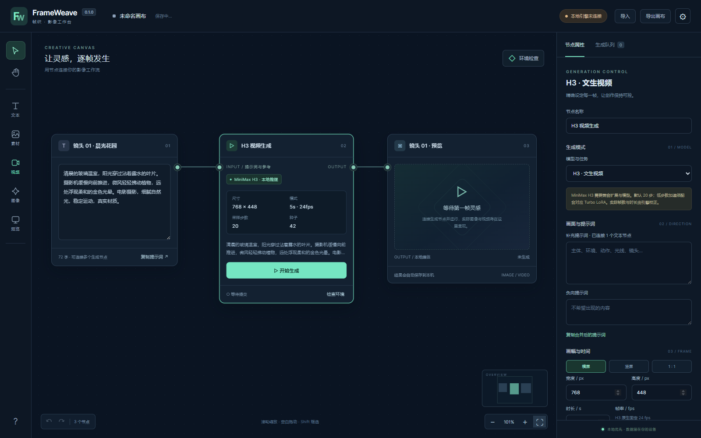

# FrameWeave 帧织

**把提示词、参考图、视频生成和结果，放进一张清楚、可控制的画布。**

深墨蓝与青绿的本地 AI 影像工作台。独立编写，无广告、账号、遥测或云端依赖；重点是 MiniMax H3 视频、Krea 2 / SDXL 图片控制、缺失项检查和可复现工作流。

> **0.1.0 初版**：客户端替代日常 ComfyUI 画布操作，生成计算由用户已有的本地 ComfyUI 后端完成。客户端不包含原参考软件代码、模型、PyTorch 或 CUDA。



## 开始使用

**[下载 Windows 便携版 · 约 8.48 MiB](https://raw.githubusercontent.com/turnsolesama/portfolio/main/frameweave/releases/FrameWeave-v0.1.0-Windows-x64.zip)** · [下载源码 ZIP](https://raw.githubusercontent.com/turnsolesama/portfolio/main/frameweave/releases/FrameWeave-v0.1.0-source.zip) · [SHA-256 校验值](https://github.com/turnsolesama/portfolio/blob/main/frameweave/releases/SHA256SUMS.txt)

Windows 用户下载本仓库 `releases/` 中的便携 ZIP，完整解压后打开 `FrameWeave.exe`（约8.46MiB）。程序使用系统 Edge 的独立应用窗口；无需另装 Python，不另外捆绑 Chromium。没有 Edge 时使用默认浏览器。

1. 启动你的本地 ComfyUI 推理服务。
2. 在帧织右上角设置填写服务地址，例如 `http://127.0.0.1:8188`。
3. 添加已有模型根目录。帧织读取模型，不移动、下载或删除模型。
4. 点击“检查环境”，核实节点、模型角色、文件结构与待补齐项。
5. 创建提示词和生成节点，连线后调整参数，先试样，再提升规格。

源码运行只需要 Python 3.11+：

```sh
python launch.py
```

可选参数：`--backend http://127.0.0.1:8188`、`--model-root <绝对目录>`、`--port 8765`、`--data-dir <目录>`、`--no-browser`。默认服务仅监听 `127.0.0.1`；初版不开放远程后端。

## 画布和生成

- 无限画布：平移、鼠标锚点缩放、节点拖动、框选、端口连线、复制、删除、撤销重做、适配视图与小地图。
- 提示词：独立文本卡片、连接生成节点、一键复制。JSON 画布可导入导出，浏览器自动保存工作状态。
- 参考图：PNG / JPEG / WebP 上传到本机推理服务。H3 支持文生、首尾帧、1–9 张图像参考；视频和音频参考请使用专用 API 工作流。
- 控制：模式、模型、种子、尺寸、步数、CFG、采样器、调度器、LoRA、降噪、时长。H3 固定 24 fps，展示按 `17n+5` 对齐的真实帧数和时长。
- 图片：Krea 2 文生图与带兼容节点/LoRA的参考编辑、SDXL 文生图和图生图。参数与节点会在提交前校验。
- 队列：只追踪本客户端提交的任务，保存复现图、耗时、执行错误和输出。结果可大图预览、视频播放。
- 取消：支持原子按任务中断的后端可取消运行中任务；旧后端只取消排队任务，不调用会影响其他客户端的全局中断。
- 高级用户：导入 ComfyUI **API 格式** JSON 工作流。普通 ComfyUI UI 格式 JSON 需要先在 ComfyUI 导出为 API 格式。

## 缺失检查与 AI 协作

区分后端在线、节点已注册、模型角色匹配、文件存在、safetensors 结构和长度一致。**结构检查不等于全文件 SHA-256 校验，也不等于推理成功。**

检查只读取指定目录下被后端列举的模型，不递归扫整盘、不把权重读进内存。修复说明可复制给 AI；默认不包含私人提示词、参考图或绝对模型路径，不自动执行 AI 建议。

## 本地数据与空间

Windows 配置和任务复现图保存在 `%LOCALAPPDATA%/FrameWeave`，画布保存在本机浏览器站点存储。视频、图像仍由后端保存在其输出目录；客户端按块传输预览，不重复缓存大视频。定期导出画布 JSON 以便迁移或备份。

关闭画布后，本地服务在约三分钟无访问后退出。后台生成不随窗口关闭而终止，重新打开可恢复本客户端任务记录。

浏览器存储按端口区分；如端口被占用，程序会换端口。请通过导出/导入迁移画布。初版尚无跨设备同步和完整项目资产归档。

## 性能、质量与范围

画布性能和生成性能分别优化：前端零依赖；本地服务零运行库依赖；模型继续共享用户已有后端。速度主要由模型、量化、显存、CPU offload、分辨率、帧数和步数决定，帧织不承诺提升模型自身画质或推理速度。

H3 先使用短片、固定种子和较低预览尺寸核实构图，再用约 1344×768 / 20 步做标准生成。4/8 步需要匹配的 Turbo LoRA；不能只减少步数就宣称保持质量。具体参数、模型许可和官方链接见 [模型指南](docs/MODELS.md)。

初版未实现完整剪辑时间线、音频编辑、超分、云端 API、付费服务、完整自定义节点编辑器或多用户服务。请参阅 [功能分析与边界](docs/ANALYSIS.md) 和 [验证报告](docs/VALIDATION.md)。

## 开发与许可

```sh
python -m unittest discover -s tests -v
node --test tests/*.test.mjs
python -m compileall -q frameweave
node --check web/app.js
```

Windows 打包使用 PyInstaller 6.22.2，见 [构建说明](docs/BUILD.md)。原创客户端采用 [MIT](LICENSE)。MiniMax H3、Krea 2 和其他模型遵守各自许可；第三方署名见 [THIRD_PARTY.md](THIRD_PARTY.md)。

项目分类：**本地化 AI 系统**。资产管理系统与工具类项目请见 [项目总览](https://github.com/turnsolesama/portfolio)。
