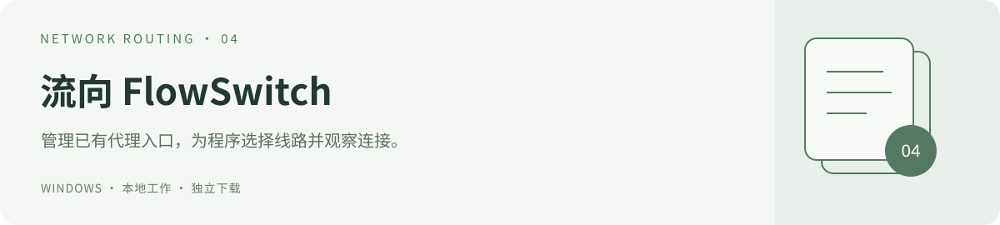

# 流向 FlowSwitch 3.5.1

管理已有 HTTP / SOCKS5 代理，让程序通过固定入口选择出口。独立模式自带运行组件，代理失效后按备用顺序接替，退出时先恢复仍归属本会话的网络设置。

[返回工具集](../) · [功能与设计](DESIGN.md) · [更新记录](CHANGELOG.md)

**[下载 Windows x64 程序包 · 3.5.1 · 68.1 MiB](https://raw.githubusercontent.com/turnsolesama/portfolio/main/proxy-switch/releases/FlowSwitch-v3.5.1-Windows-x64.zip)** · [源码包](https://raw.githubusercontent.com/turnsolesama/portfolio/main/proxy-switch/releases/FlowSwitch-v3.5.1-Windows-Source.zip) · [下载与校验](releases/README.md)

## 快速开始

1. 完整解压，双击 `FlowSwitch/FlowSwitch.exe`，保留旁边的 `app` 文件夹。
2. 添加自己的代理入口，或打开代理客户端后让 FlowSwitch 发现入口。
3. 关闭上游客户端的 TUN、系统代理和代理守卫，保留代理服务运行。
4. 在「代理管理」启用独立分流。顶部选择首选线路并统一切换；右键程序可设置专用线路。
5. 在「自动接替设置」调整备用顺序。全部代理失效时默认暂停；只有明确勾选才允许直连。

统一切换会撤销本工具管理的程序专用线路。切换影响新连接；旧连接未恢复时，可右键程序预览并确认重连，不会退出程序或关闭其他应用的连接。

## 运行要求

Windows 10 1809+ / Windows 11 x64，保留系统自带的 Windows PowerShell 5.1、.NET Framework 4.x 和 curl.exe。完整程序包自带 Node.js 24.19.0、mihomo 1.19.29 的标准及兼容构建、许可证和内核源码，无需另装 Node.js、npm 或 Clash，无需配置 PATH。首次运行不下载组件，不要求管理员权限。

不提供 VPN 服务、订阅、节点或账户，仍需自己的可用代理。32 位 Windows、Windows 7/8 和原生 ARM64 包不在本次交付范围。源码开发可使用已安装的组件。

## 3.5.1 自动接替修复

- 每个健康请求最多等待 6 秒，验证代理隧道和外网响应，减少短暂变慢造成的误判；连续三轮软故障后接替。
- 本地端口两次确认退出且备用已检测成功时提前接替。检测程序自身出错单独标记为未知，不当成全部线路故障。
- 重载规则与回滚保留未改变策略的当前备用；短时间重开可使用两分钟内仍有效的健康记录，完整启动不再先清空已有独立规则。
- 界面分别显示首选与当前出口，显示接替原因、检测停滞和暂停状态；最近 100 次接替记录只保存在本机，不记录网站、程序路径或凭据。

检测站点可达不能保证每个网站、游戏登录或账户都正常。只有流量实际进入固定入口的程序才受分流规则控制；软件不会自动开启 TUN，也不会强制拦截全机流量。

## 退出与升级

正常退出先恢复仍归属本会话的系统代理和用户代理变量，再关闭自有内核；备份中的本地代理已失效时恢复直连。界面或内核崩溃由独立恢复进程处理，断电残留在下次登录恢复。其他程序后来的网络设置会保留。

恢复直连不能使本来需要代理的网站变为可直连；已缓存旧代理地址的应用可能需要重开。更新前正常退出 FlowSwitch，再解压新包；本机数据保存在 `%USERPROFILE%\.proxyswitch`，不随安装包覆盖。新电脑应配置自己的入口，不复制其他电脑的个人配置、内核路径、订阅或账户。

## 验证与构建

本版通过 279 项静态及单元检查、21 项真实独立内核检查、17 项完整启动/退出与运行组件检查，以及 12 项 Windows 包和真实界面检查。测试覆盖代理退出、隧道失败、慢响应、规则重载、短时重开、程序分流与退出恢复；隔离测试不改真实用户网络设置，不能代替其他电脑和真实业务的长期验证。

源码目录使用 `Prepare-Runtime.ps1 -Destination <新组件目录>` 从官方来源按 `runtime.lock.json` 准备并校验组件，然后用 `Build-WindowsPackage.ps1 -Destination <新包目录> -RuntimeDirectory <组件目录>` 构建。`Test-All.ps1` 执行静态及单元检查，`Test-WindowsPackage.ps1 -PackageDirectory <包目录>` 检查程序包。

[第三方组件与许可证](THIRD_PARTY_NOTICES.md) · [MIT 许可](LICENSE) · [旧版使用参考](README-legacy-3.3.2.md)。历史安装包继续保留在 [releases](releases/README.md)。
