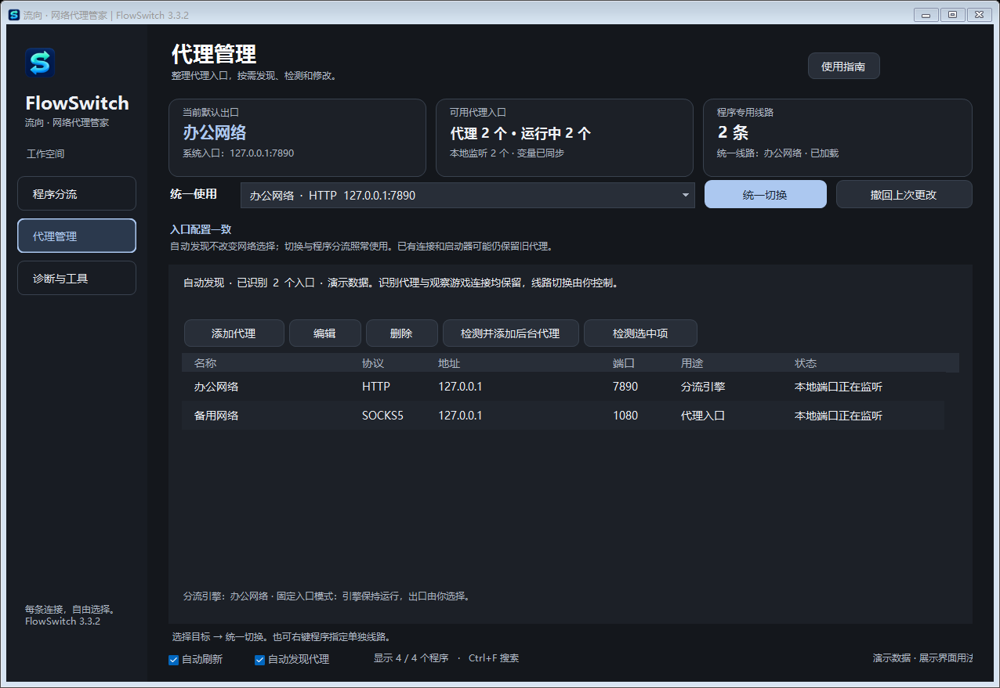
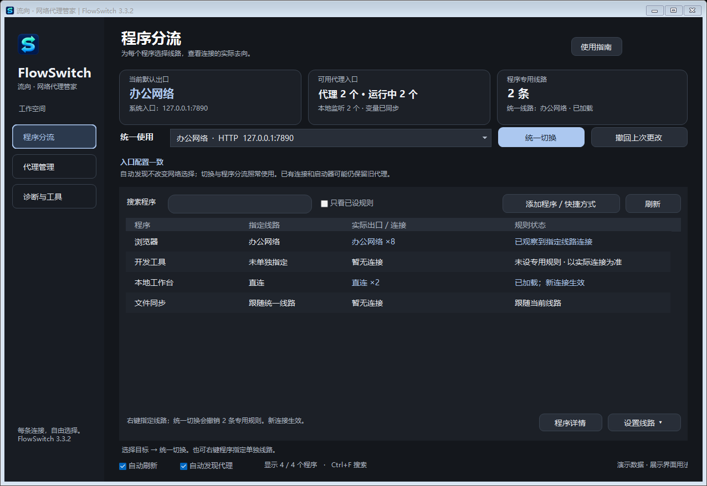
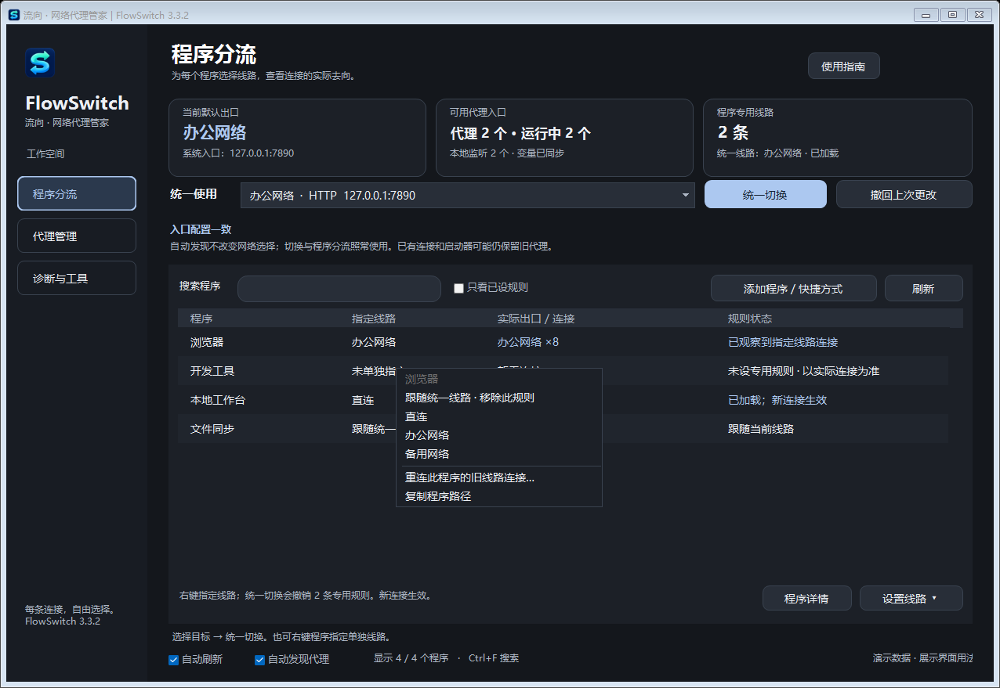

# 流向 · 网络代理管家 | FlowSwitch

[返回三个软件的目录](../)


**每条连接，自由选择。** 原 ProxySwitch 更名为 FlowSwitch；原代理设置与备份继续使用同一数据目录。

## 下载 FlowSwitch

3.3.2 采用中性深色与灰蓝强调色、侧边导航及细滚动条，修复拖动和缩放时原生横向白条闪现的问题；设计与交互说明见 [DESIGN.md](DESIGN.md)。

**[直接下载 Windows x64 程序包 · v3.3.2](https://raw.githubusercontent.com/turnsolesama/portfolio/main/proxy-switch/releases/FlowSwitch-v3.3.2-Windows-x64.zip)**

完整解压后打开 `FlowSwitch` 文件夹，双击 **`FlowSwitch.exe`**。无需编译或安装开发工具；请保留同目录的 `app` 文件夹。需要 Windows 10 / 11 x64、Windows PowerShell 5.1、.NET Framework 4.8 和 `curl.exe`。

[单独下载源码包](https://raw.githubusercontent.com/turnsolesama/portfolio/main/proxy-switch/releases/FlowSwitch-v3.3.2-Windows-Source.zip) · [下载与 SHA-256 校验](releases/README.md) · [完整运行要求](#运行要求)

一个通用的 Windows 代理管理面板：添加自己的代理入口，统一切换系统网络，或为程序指定单独线路。**不预设任何 VPN 品牌，也不捆绑代理服务。**

FlowSwitch 用来整理多个代理客户端提供的入口、选择默认出口、给不同程序分配线路，并观察连接实际走向。它管理你已有的代理，不提供 VPN 服务、订阅或节点；基础切换不绑定品牌，固定入口与按程序分流目前适配 Clash Verge Rev / mihomo。

## 功能一览

| 功能 | 具体作用 | 生效条件 |
| --- | --- | --- |
| 代理管理 | 添加、修改、删除 HTTP / SOCKS5 入口，自定义名称、地址、端口和关联程序 | 客户端提供对应协议端口；目前不保存代理账号密码 |
| 后台代理发现 | 识别已知代理内核和现有系统代理入口，确认监听后补充列表 | 发现只补充列表，不自动选择或切换线路；未知入口可手动添加 |
| 统一切换 | 同步系统代理和命令行变量，撤销本工具的程序专用线路 | 影响遵循这些设置或接入引擎的新连接 |
| 固定本地入口 | 应用继续使用同一个本地端口，在引擎内切换 HTTP、SOCKS5 或直连出口 | 分流引擎保持运行；作为上游的代理也需要可用 |
| 按程序分流 | 右键设置直连、某个代理或跟随统一线路，按 EXE 完整路径加载规则 | 需要分流引擎，且目标程序的流量实际进入引擎 |
| 重连旧线路 | 预览并确认关闭所选程序的旧连接，由程序自行重连 | 不退出软件；仅处理预览后身份仍匹配的连接 |
| 实际出口观察 | 显示程序及相关子进程连接、已观察到的出口、规则载入和连接失败 | 无法确认时显示入口外连接或出口待确认，不冒认为成功 |
| 撤回上次更改 | 恢复上次切换前的系统设置、变量与本工具管理的规则 | 检查端口可用性及设置归属，避免覆盖其他客户端后来的选择 |
| 诊断与桌面集成 | 检测入口、重载规则、本机导出诊断报告；统一桌面、窗口和任务栏图标 | 报告不自动上传；Windows 程序包完整解压后运行 |



## 快速开始

1. 普通使用请下载 [Windows x64 程序包](https://raw.githubusercontent.com/turnsolesama/portfolio/main/proxy-switch/releases/FlowSwitch-v3.3.2-Windows-x64.zip)，完整解压后双击 **`FlowSwitch.exe`**。源码开发另有 [源码包](https://raw.githubusercontent.com/turnsolesama/portfolio/main/proxy-switch/releases/FlowSwitch-v3.3.2-Windows-Source.zip)，源码目录使用 `启动代理切换.cmd`。
2. 等待后台代理自动加入列表；可在 **代理管理 → 检测并添加后台代理** 手动重扫，或用「添加代理」填写自定义地址。
3. 在顶部选择直连或已添加的代理，点击 **统一切换**。
4. 在 **代理管理** 编辑已安装的 Clash Verge HTTP / 混合入口，填写内核路径并勾选 **用作程序分流引擎**、**固定本地入口**。保存不会改变网络；手动点击统一切换后，引擎保持本地入口，按所选上游转发。右键程序指定单独线路，继续使用原启动方式；普通设置不再生成启动图标。

默认模板不包含任何 VPN 品牌。启动时读取已有配置并自动识别本机代理；升级保留原来的名称、端口、路径与稳定标识。自动发现只补充列表，不自动选择线路。界面每次刷新同步配置与实读状态。

Windows 程序包无需编译或安装开发工具。EXE 是编译后的 Windows 启动入口，`app` 文件夹包含运行模块；请完整保留该目录，不能只复制 EXE。双击「创建桌面快捷方式.cmd」可创建或更新指向 EXE 的桌面入口。运行仍使用 Windows 自带 PowerShell 5.1 和 .NET Framework；可选分流功能的依赖见下文。源码包保留构建脚本和测试，程序包只包含运行所需文件。

## 统一切换会做什么

- 同步当前用户 Windows 系统代理、HTTP_PROXY、HTTPS_PROXY、ALL_PROXY。
- 撤销本工具保存的程序专用线路，使受系统代理或分流引擎管理的新连接使用所选目标。
- 如果使用分流引擎，写入优先匹配的统一规则，不让原来的程序例外继续分流。
- 切换前备份系统入口、变量和程序规则；修改与线路检查失败会尝试恢复。写入后重新读取系统入口与变量，确认成功才更新当前线路。
- 保留用户的本地绕过列表。已有连接和已经继承的环境变量可能仍需重开程序。

切换时会显示「检查入口 → 更新规则 → 同步变量 → 写入并核对」的实际阶段。三个连通性检查并行进行，任一通过即继续，单个检查最长 5 秒；引擎重载、Windows 写入和连接刷新另外计时，这不是整个切换固定耗时的承诺。用户操作会让后台自动发现提前让路。「诊断与工具」仍保留完整逐站检测。

**统一切换影响遵循系统代理或已接入分流引擎的新连接；已接入启动适配的程序在下次从托管入口打开时读取统一目标。** 独立代理、VPN 隧道及忽略系统代理的软件不能靠系统代理设置强制接管，本工具不自动开启 TUN，也不结束应用。



## 代理管理

每个入口具有独立标识，名称可以自由修改；改名不会丢失程序规则。

| 字段 | 内容 |
| --- | --- |
| 名称 | 方便识别的名称，如办公网络、备用线路 |
| 协议 | HTTP 或 SOCKS5 |
| 地址 | IPv4、IPv6 或域名；不含协议前缀、账号或路径 |
| 端口 | 1–65535 |
| 关联程序 | 可选的客户端 EXE，便于从工具打开 |
| 分流内核 | 启用程序分流引擎时填写 |

当前版本不保存代理账号密码。VPN 客户端需要提供 HTTP / SOCKS5 端口才能作为入口添加；仅提供系统隧道的 VPN 仍需在其客户端管理。

自动发现与连接监控都保留。自动发现仅向身份已识别的代理内核（或用户填写的内核完整路径）发送握手，每次发送前复核进程和端口归属；不向游戏、启动器或无关应用的通信端口发送协议请求。已成功识别的入口缓存 10 分钟，失败结果缓存 30 秒；代理重启、新端口出现时重新识别，每轮最多检查两个新入口。

对于未知代理客户端，工具可从当前系统代理与用户代理变量中读取已有的本地入口，确认有监听后补充列表，不主动猜测协议。该入口的协议来自设置，是否能访问目标网站仍需检测。也可手动添加入口，再点击「检测并添加后台代理」。远程入口不定时连接。

底部「自动发现代理」开关控制后台识别；「自动刷新」控制定时状态读取。关闭自动发现仍保留程序连接监控和手动检测。启动、刷新、退出不写系统代理、环境变量或程序规则，不重新应用上次选择。自动发现只保存代理列表元数据，实际网络切换由你点击确认。

通过 HTTP CONNECT 或 SOCKS5 握手识别协议，避免把普通网页、控制接口和需要认证的端口直接当成可用入口。HTTP 探测尝试建立到 www.microsoft.com:443 的连接，SOCKS5 探测只协商本地协议；不携带账号或读取订阅。探测有时间与数量限制，较慢或未识别的入口可手动添加。协议识别不代表所有目标网站均可访问，可再使用「检测选中项」。

验证通过后自动补充到本机代理列表，保存前备份；已有代理的名称、稳定标识、引擎选择与程序规则保持原样。同一端口只保存一次，混合端口优先使用 HTTP。删除过的本地入口会加入忽略列表，重扫不会自动加回；需要恢复时可手动添加。手动检测只补充代理列表，不更改系统代理、环境变量或程序路由。

正在被当前入口或程序规则使用的代理不能直接删除；先统一切换到其他目标。改变地址、端口后，需要重新统一切换或重载程序规则。

## 固定入口与程序分流（3.2.0）

3.2.1 已包含固定入口和按程序重连，并统一为 FlowSwitch 新名称与图标。

| 工作模式 | 系统入口如何变化 | 适用场景 |
| --- | --- | --- |
| 系统代理模式 | 普通 HTTP 目标直接使用该代理端口；直连关闭系统代理。SOCKS5 目标需要引擎提供 HTTP 入口 | 切换浏览器、命令行等遵循系统设置的软件 |
| 固定入口模式 | 保持同一个分流引擎本地入口，切换引擎上游或直连出口 | 减少端口反复变化，为已接入引擎的软件统一或单独分配线路 |

**固定入口模式下，引擎必须保持运行。** 选择其他代理作为出口后，连接仍先经过本地引擎，再转给所选代理；这不表示切换失败。入口和出口是两个不同环节。

软件连接同一个本地引擎入口，管理器在引擎内选择 HTTP、SOCKS5 或直连。入口不会随出口改变；分流引擎必须保持运行，即便选择的是另一家代理。当前引擎适配使用 Clash Verge / mihomo 已有的本地命名管道，需要 Node.js 22+；不会下载内核或修改订阅、账号、DNS、TUN。其他品牌提供的 HTTP/SOCKS5 入口可作为上游，不要求 Upnet。

- **统一切换**：改变默认出口并撤销程序例外；固定模式下连直连也通过同一个本地入口。兼容系统模式保留原有行为。
- **右键程序指定线路**：加载按 EXE 路径匹配的引擎规则，不再自动创建启动快捷方式。程序仍从原图标、开始菜单或搜索工具启动。网络连接必须已经进入引擎，规则才能起作用；独立联网子 EXE 可分别指定。
- **重连旧线路连接**：先显示所选 EXE 的旧连接数量，经用户确认才逐条关闭；不退出程序，不关闭其他软件、已经走目标线路或身份不明的连接。由软件自行重连。预览超过 60 秒或线路改变后失效，不会关闭预览之后的新连接。
- **真实状态**：规则载入与观察到目标出口分别显示。绕过引擎、旧连接和连接失败均有提示；保存规则不代表已经接管。
- **防回路**：固定模式为代理内核及关联程序添加直连保护，不把其连接再转发给自身。所选引擎端口必须与控制接口实读端口匹配。

不遵循系统代理、自带其他代理或使用独立 VPN 隧道的软件仍可能绕过入口。此版本没有强制拦截全机流量，游戏登录和账号服务可用性不能由本地代理握手代替验证。普通系统代理不能让所有软件任意切换，这一限制会显示在界面中。

如需撤除引擎：先编辑引擎取消“固定本地入口”并保存，再统一切换到直连；已加载规则撤除后可取消引擎标记。启动、刷新、退出均不自动重新应用选择。

旧版本已经创建的兼容启动入口及备份保留；当同一程序改用引擎规则时，其旧启动目标改为跟随系统入口，不再优先覆盖引擎规则。不要用未验证的兼容入口重启承载当前对话的应用。

协议依据：[mihomo 连接查询及按连接 ID 关闭接口](https://wiki.metacubex.one/en/api/)。

## 可选的程序分流引擎

| 功能 | 是否需要分流引擎 |
| --- | --- |
| 直连、普通 HTTP 系统统一切换 | 不需要 |
| 检测 HTTP / SOCKS5 入口 | 不需要 |
| 旧版 Chromium/Electron HTTP / 直连启动入口兼容 | 不需要；不作为当前普通程序分流方式 |
| 当前右键按程序指定线路 | 需要；流量必须实际进入引擎 |
| SOCKS5 系统统一切换 | 需要，由引擎提供本地 HTTP 入口 |

目前程序分流适配 **Clash Verge Rev / Mihomo**。在对应代理编辑窗口，填写其本地 HTTP / 混合端口和内核 EXE，勾选「用作程序分流引擎」，让引擎保持规则模式。它使用 Verge 现有的本地命名管道与全局脚本，不开放新的 HTTP 控制端口。

系统代理模式下，统一切换到普通 HTTP 代理直接使用它自己的端口；指定引擎自身或 SOCKS5 目标时经由引擎。固定入口模式下，所有受管理目标均经由所选引擎入口。原始规则和脚本保留在配置中，可撤回恢复。旧版程序启动适配仅保留兼容，不是当前右键分流的默认方式。

实现依据：[Mihomo 路由规则](https://wiki.metacubex.one/config/rules/)、[HTTP 出站](https://wiki.metacubex.one/config/proxies/http/)、[SOCKS5 出站](https://wiki.metacubex.one/config/proxies/socks/)、[Verge 全局脚本](https://www.clashverge.dev/guide/script.html)。

## 为程序指定线路

右键程序选择线路，当前普通分流统一使用已配置的引擎规则，不自动创建「指定代理」启动图标。继续使用原桌面图标、开始菜单或搜索工具打开程序。选择「跟随统一线路」会撤销该程序的专用目标。支持 EXE、指向 EXE 的快捷方式、文件拖放、名称和路径搜索。



引擎规则按 EXE 完整路径生效；启动适配随启动环境传给子进程。列表会汇总同一程序目录内的父子进程，并显示子进程绕过本地入口的连接失败。一个软件可能有多个独立联网进程；升级导致路径改变时，应移除旧路径并重新添加。程序路径使用 Windows 的有限查询权限接口获取，不枚举目标模块或读取进程内存；读取被拒绝时仍按 PID 显示，不能直接从缺少路径的行设置路径规则。已配置代理的 `SynSent` 会显示具体端口和「连接尚未建立」，不会算作成功出口。没有证据确认出口的连接会显示「入口外连接」或「出口待确认」，不将它冒认为直连。

## 常见问题

### 怎样确认真正走通

| 界面现象 | 含义与下一步 |
| --- | --- |
| 已保存或规则已加载 | 设置已记录或引擎已载入，还不能证明应用已成功联网 |
| 已观察到指定线路连接 | 已有目标线路的连接证据；目标网站或账号登录仍需实际验证 |
| 暂无连接 | 当前未观察到相关连接，打开需要联网的功能后再检查 |
| 入口外连接 / 出口待确认 | 检查应用独立代理、实际联网子进程与引擎入口 |
| SynSent / 连接尚未建立 | TCP 还在尝试建立连接，应检查端口监听，不能算作成功出口 |
| 旧线路仍有连接 | 可能是切换前建立的长连接，按需预览并确认重连 |

**为什么指定了备用代理，仍需要启动另一个客户端？** 如果那个客户端承担固定入口的引擎职责，它需要保持运行。如果没有使用固定入口，却只有启动旧客户端才能联网，应检查应用保存的旧端口、独立启动参数、继承的环境变量及子进程路径，不能仅凭现象就判定为“缓存”。

**为什么重启程序后仍然没变化？** 重启只会重新建立连接，不会自动修正错误入口、独立代理设置或不匹配的 EXE 路径。先检查目标代理监听、实际联网进程、入口和规则，再测试目标功能。端口可连接、规则已加载、网站能够登录是三个不同的验证结果。

**能否让电脑上所有软件任意切换？** 本版本管理遵循系统代理或已接入引擎的连接；不能保证接管忽略系统代理的软件、独立 VPN 隧道或自带代理的应用。它不自动开启 TUN、不修改 DNS、路由或 WinHTTP，也不强制退出其他应用。

**会不会运行后抢回我选择的线路？** 启动、刷新、退出不写系统代理、代理环境变量和程序规则，不重新应用历史选择。自动发现可补充代理列表；实际切换由用户点击触发，自动发现与自动刷新各有独立开关。

## 运行要求

- Windows 10 / 11，Windows PowerShell 5.1、.NET Framework 4.8、`curl.exe`。
- Chromium/Electron 的 HTTP / 直连启动适配，以及 HTTP 系统代理与直连，不要求 Node.js。引擎规则分流与 SOCKS5 统一切换需要 Node.js 22+ 和受支持的分流引擎。
- 已在 Windows PowerShell 5.1、Node.js 24.18.0、Mihomo 1.19.29 上验证。

软件不自动下载依赖。桌面快捷方式可通过以下命令创建：

```powershell
powershell.exe -NoProfile -ExecutionPolicy Bypass -File .\Install-Shortcut.ps1
```

## 本机数据与更新

3.1.1 起，本机数据默认位于 `%USERPROFILE%\.proxyswitch`，与发布源码分开保存。管理器、桌面启动入口和后台工作进程使用同一个目录，避免 MSIX 应用启动的进程与普通桌面进程看到不同的 AppData 文件。依据：[Windows 打包桌面应用的文件重定向](https://learn.microsoft.com/en-us/windows/msix/desktop/desktop-to-uwp-behind-the-scenes)。

首次使用新版默认目录时，会复制当前启动环境可见的 `%LOCALAPPDATA%\ProxySwitch` 数据及备份，保留原文件。复制完整后才启用新目录；已有新目录不会被旧配置覆盖。这个迁移只处理本机文件，不应用历史网络选择。若旧版已经产生两套配置，需要先核对并合并差异；自动迁移不会自行搜索或合并其他应用的私有目录。

完成迁移后，旧快捷方式中指向原默认 AppData 目录的 `-DataDirectory` 参数会按迁移记录转到共享目录。自行指定的其他目录和 `PROXY_SWITCH_DATA_DIR` 仍按原设置使用；测试继续使用独立目录。

| 文件 | 用途 |
| --- | --- |
| `config.json` | Version 3 的 Profiles、可选 Routing 引擎及 DiscoveryIgnored 本机端口忽略列表 |
| `selection.json` | 已应用的系统入口和目标线路 |
| `app-rules.json` | 分流引擎规则与统一默认路由 |
| `program-proxies.json` | 程序启动代理目标 |
| `program-shortcuts.json` / `program-launches.json` | 本机入口备份索引与启动会话核对 |
| `last-program-launch.json` | 最近一次启动结果、程序路径和实际配置目录，仅存本机 |
| `storage-layout.json` | 迁移来源与旧默认路径兼容记录 |
| `backups/` | 修改前系统、变量、规则和代理列表备份 |

含原 Clash 节点信息的配置备份留在 Clash 用户目录的 `proxy-switch-backups` 内，不进入发布包。更新时关闭本工具并替换程序文件，本机数据保持独立。

2.2 的固定代理设置可自动读入通用模型，保存代理管理设置后使用 Version 3 格式。2.1 及更早的目录内数据应先备份，再复制到上述本机目录，不覆盖已有新版设置。

移除工具前可以先统一切换到直连以撤回当前托管的路由设置，再关闭工具。删除程序文件本身不会修改网络或清理本机备份。已接入的程序桌面入口依赖工具文件；卸载前先撤回其启动代理适配并恢复原快捷方式。

## 诊断与恢复

「诊断与工具」提供所选代理的 HTTPS 探测、规则重载、匿名报告导出，以及打开该入口关联的代理程序。程序不再包含任何特定应用的启动按钮。

检测不携带账户凭据。HTTP 401 只说明接口可达但未认证；网页 403 可能要求验证或拒绝请求，不证明登录后可用。报告只含匿名线路标识、就绪状态、端口和数量，不包含代理名称、地址、账号、订阅、目标网站、程序名称或路径。

撤回前会检查备份中的系统入口和本地代理变量端口；端口未监听时不恢复任何设置。失败回滚仅恢复仍属于本次操作的值，保留其他客户端的新选择。界面的当前入口来自实读，历史选择不代表当前生效线路。

已运行程序保留启动时继承的环境变量；更改注册表中的用户代理变量不会直接改写其内存。若连接记录持续显示旧代理，可在保存任务后手动重开程序及其启动器；这是一种排查方法，不能仅凭旧端口就认定登录故障由缓存造成。不自动重启游戏、启动器、浏览器或代理客户端。依据：[Windows 进程环境变量](https://learn.microsoft.com/en-us/windows/win32/procthread/environment-variables)。

## 开发与验证

`Build-WindowsPackage.ps1` 使用本机 .NET Framework 的 C# 编译器生成 x64 WinExe，不下载编译依赖。只有构建者需要编译器，下载程序包的用户无需自行构建。启动器直接创建隐藏的 PowerShell 子进程，不经过 cmd 命令拼接。依据：[Microsoft 编译输出选项](https://learn.microsoft.com/en-us/dotnet/csharp/language-reference/compiler-options/output)、[ProcessStartInfo.UseShellExecute](https://learn.microsoft.com/en-us/dotnet/api/system.diagnostics.processstartinfo.useshellexecute)。

```powershell
powershell.exe -NoProfile -ExecutionPolicy Bypass -File .\Test-All.ps1
powershell.exe -NoProfile -STA -ExecutionPolicy Bypass -File .\ProxySwitch.ps1 -SmokeTest
powershell.exe -NoProfile -STA -ExecutionPolicy Bypass -File .\Test-PassiveLifecycle.ps1
powershell.exe -NoProfile -STA -ExecutionPolicy Bypass -File .\Test-DiscoveryUI.ps1
powershell.exe -NoProfile -STA -ExecutionPolicy Bypass -File .\Test-AutomaticDiscoveryUI.ps1
powershell.exe -NoProfile -STA -ExecutionPolicy Bypass -File .\Test-SwitchInteraction.ps1
powershell.exe -NoProfile -ExecutionPolicy Bypass -File .\Test-ProgramLaunch.ps1
powershell.exe -NoProfile -ExecutionPolicy Bypass -File .\Test-Storage.ps1
# 构建与测试可直接运行的 Windows 程序包
powershell.exe -NoProfile -ExecutionPolicy Bypass -File .\Build-WindowsPackage.ps1 -Destination C:\Temp\FlowSwitch-Windows
powershell.exe -NoProfile -ExecutionPolicy Bypass -File .\Test-WindowsPackage.ps1 -PackageDirectory C:\Temp\FlowSwitch-Windows\FlowSwitch
```

188 项断言覆盖代理模型、迁移、路由、事务回滚、并发改写保护、匿名报告、协议识别、自动发现缓存与有限进程查询。四种隔离界面回归覆盖自动发现、新端口识别、游戏行保留、连续 72 秒观察、外部选择、用户切换优先、阶段进度和设置实读。测试使用独立数据与模拟 Windows 写入，不切换用户正在使用的网络。临时父子程序真实验证启动环境继承、旧代理变量隔离、程序已运行时拒绝重复启动、快捷方式备份恢复及子进程绕过状态。13 项存储断言覆盖默认共享目录、显式目录优先级、迁移数据与原文件保留、快捷方式备份重定位、旧参数兼容及复制失败不发布半成品。

在一次现场只读预检中，当前可用 HTTP 代理 1.78 秒通过；无响应入口的并行检查 4.39 秒返回失败。这是预检耗时，不能当作完整切换时间，也不能保证其他网络同样快。

3.0.2 关闭自动发现后，现场仍出现游戏登录失败，随后也观察到管理器保持运行时一次登录成功。3.0.3 的改动修复已确认的实现问题，尚不能据此宣布游戏错误 [4] 的具体原因已找到。真实登录与长期稳定性需独立观察，单元测试不能代替。

发布前还使用隔离的 Mihomo 实例验证了 4 种程序线路和 4 种统一线路的实际规则命中与 HTTPS 连接；测试实例恢复原配置，用户实例没有被改动。

```powershell
# 查看状态
.\ProxySwitch.ps1 -Status
.\ProxySwitch.ps1 -AppStatus
# 检测并补充本机代理列表（不切换网络）
.\ProxySwitch.ps1 -Discover
# 指定已存在的代理标识，或 Direct，执行统一切换
.\ProxySwitch.ps1 -Switch <代理标识>
# 生成公开演示图
.\ProxySwitch.ps1 -Demo -PreviewView Proxies -PreviewPath C:\Temp\proxies.png
# 按显式清单创建发布包，目标目录须尚未存在
.\Build-Release.ps1 -Destination C:\Temp\ProxySwitch-release
```

测试可用 `PROXY_SWITCH_DATA_DIR` 隔离本机数据。路由集成测试同时设置 `PROXY_SWITCH_TEST_ENGINE_DIR` 与以 `\\.\pipe\ProxySwitch-Test-` 开头的 `PROXY_SWITCH_TEST_PIPE`，以测试专用实例替代用户实例。

Windows 程序包另做独立验收：文件哈希、移动到含中文/空格的路径、EXE 打开真实界面并正常退出、显式配置目录、文件缺失时报错，以及临时桌面快捷方式的目标和工作目录。验收只操作临时副本，不切换真实网络。

YAML 解析器的 CommonJS 构建已包含，无需 `npm install`。原创代码使用 [MIT](LICENSE)，第三方组件见 [THIRD_PARTY_NOTICES.md](THIRD_PARTY_NOTICES.md)。
